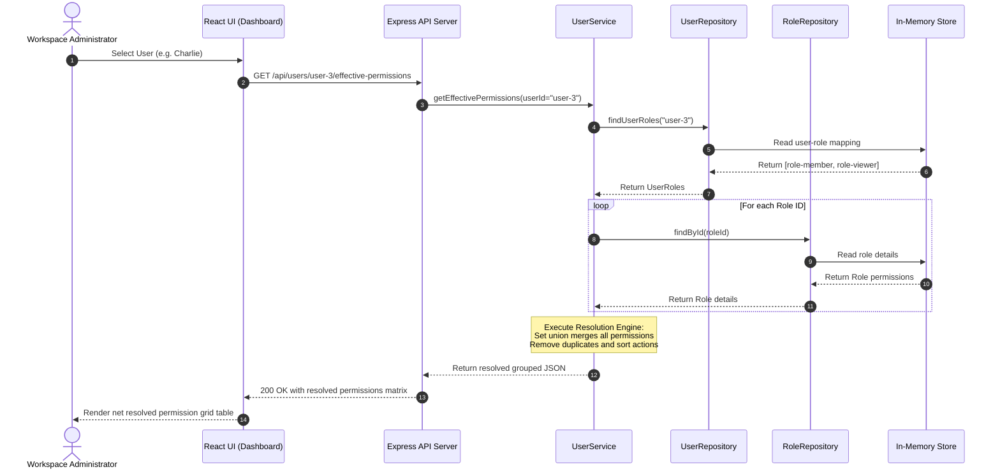

# System Design — Workbench RBAC Permission Builder

This design document provides a comprehensive technical overview of the architecture, algorithms, database models, and design decisions underpinning the **Workbench** RBAC Permission Builder.

---

## 1. Architecture Overview
Workbench is built using a clean, decoupled **Enterprise Layered Architecture**. The backend maintains a strict separation of concerns through controllers, services, and repository layers, while the frontend operates as a reactive single-page application (SPA) built with Vite, React, and TypeScript.

### Request Flow
```
[React SPA Client]
        │
        ▼ (HTTP REST with JSON)
[Express Router Layer] (CORS, body parser, custom request logger)
        │
        ▼
[Zod Validation Middleware] (Checks payload schemas)
        │
        ▼
[Controller Layer] (Route bindings, request validation status routing)
        │
        ▼
[Service Layer] (Business rules logic, Union-based permission calculation)
        │
        ▼
[Repository Layer] (Interface CRUD abstraction)
        │
        ▼
[In-Memory Mock Store] (Preseeded global JS Arrays)
```

---

## 2. System Flow Diagram

The following Mermaid sequence diagram illustrates the user assigning a custom role and calculating the net resolved permission grid:



---

## 3. Permission Resolution Design

### The Core Algorithm
The Permission Resolution Engine computes the net access rights granted to a user holding a collection of role profiles.

The mathematical formulation represents the resolved set $P_{effective}$ as a union of all individual role permission sets $P_{R_i}$:
$$P_{effective} = \bigcup_{i=1}^{k} P_{R_i}$$

#### Pseudo-code
```typescript
function getEffectivePermissions(userId: string): Record<string, string[]> {
    // 1. Fetch user assignment mappings
    const userRoles = UserRepository.findUserRoles(userId);
    
    // 2. Union-merge using a Set structure
    const flatPermissionsSet = new Set<string>();
    for (const assignment of userRoles) {
        const role = RoleRepository.findById(assignment.roleId);
        if (role) {
            for (const permission of role.permissions) {
                flatPermissionsSet.add(permission); // O(1) set insertion
            }
        }
    }
    
    // 3. Re-structure into grouped resource-to-action lists
    const resolved: Record<string, string[]> = {};
    for (const key of Object.keys(SYSTEM_PERMISSIONS)) {
        resolved[key] = [];
    }
    
    for (const permissionString of flatPermissionsSet) {
        const [resource, action] = permissionString.split(":");
        resolved[resource].push(action);
    }
    
    // 4. Sort actions deterministically
    for (const key of Object.keys(resolved)) {
        resolved[key].sort();
    }
    
    return resolved;
}
```

### Complexity Analysis
- **Time Complexity**: $O(R \times P)$ where $R$ is the number of roles the user holds, and $P$ is the average number of permissions per role. Since $R < 10$ and $P \le 20$ in standard SaaS configurations, execution is instantaneous ($<1\text{ms}$).
- **Space Complexity**: $O(U)$ where $U$ is the size of the resolved unique permissions set, upper-bounded by the absolute maximum system permissions (19).

### Edge Cases
1. **User has no roles**: Returns empty arrays for all resources.
2. **Empty permissions inside a role**: Gracefully skipped, Set union ignores empty values.
3. **Overlapping permission permissions**: The Set structure natively eliminates duplicates, returning a single instance of the action.

---

## 4. Backend Architecture
The backend is structured under an clean layered architecture:

- **Models**: Defines interfaces (`types.ts`).
- **Repositories**: Standard repository pattern files (`UserRepository.ts`, `RoleRepository.ts`) that handle query access. Hot-swapping to Prisma/Mongoose requires only replacing repository implementation without touching controllers or routing layers.
- **Services**: Contains business policies (`RoleService.ts`, `UserService.ts`) like verifying unique names and checking system role configurations.
- **Controllers**: Thin controllers mapping API routing contexts to responses.

---

## 5. Frontend Architecture
The React application follows a modular page-and-component layout:

- **State Store**: Uses a lightweight AppContext wrapper to keep user/role listings and toast notifications synchronized.
- **Pages**:
  - `Dashboard`: Explains engine mechanics and displays metrics.
  - `RoleManagement`: Manages role lists, creation modals, and templates.
  - `UserManagement`: Grid of users linking to role attachments.
  - `EffectiveViewer`: Explains how overlapping roles resolve.
- **Design system**: Custom CSS overrides providing a smooth dark-themed grid with micro-animations.

---

## 6. Data Model Design

### Role Model
```json
{
  "id": "role-admin",
  "name": "Admin",
  "description": "Administrative access for project management and team invitation.",
  "permissions": [
    "projects:view",
    "projects:create",
    "projects:edit",
    "tasks:view"
  ],
  "isSystem": true
}
```

### User Model
```json
{
  "id": "user-3",
  "name": "Charlie Brown",
  "email": "charlie.brown@workbench.com",
  "avatarUrl": "https://images.unsplash.com...150"
}
```

### UserRole Model
```json
{
  "id": "ur-3",
  "userId": "user-3",
  "roleId": "role-member"
}
```

---

## 7. API Design
See the details inside the Postman collection at [API_COLLECTION.json](file:///c:/Users/Asus/Desktop/Custom%20Role%20&%20Permission%20Builder/API_COLLECTION.json) or the README.md.

---

## 8. Validation Strategy
- **Zod Schema validation**: Executed on API controller routes. Toggles error mapping when role names are duplicate, empty, contain illegal characters, or use invalid permissions.
- **Client Form validation**: Triggers inline validation feedback on fields in the Role Form Modal.

---

## 9. Security Design
1. **Input Sanitization**: Prevents XSS script injection in textareas and names.
2. **Access Guards**: Prevents PUT/DELETE on system-locked roles.
3. **Double Assignment Prevention**: Gracefully bypasses duplicate assignments.

---

## 10. Logging Design
Structured HTTP request logging outputs to stdout on every request, tracking latency, paths, status codes, and request IDs:
```
[INFO] [2026-06-26T12:22:06.120Z] method=POST path=/api/roles status=201 latency=3ms requestId=a5e9d98e-4a6c-48c9-8d77-66a9d7bb36fc ip=127.0.0.1
```

---

## 11. Deployment Design
- **Dockerfile**: Standardized builder/runner multi-stage Dockerfiles compiling TS backend and React frontend.
- **Docker Compose**: Orchestrates ports `3000` (frontend via Nginx) and `5000` (backend Express API) in a bridge network.
